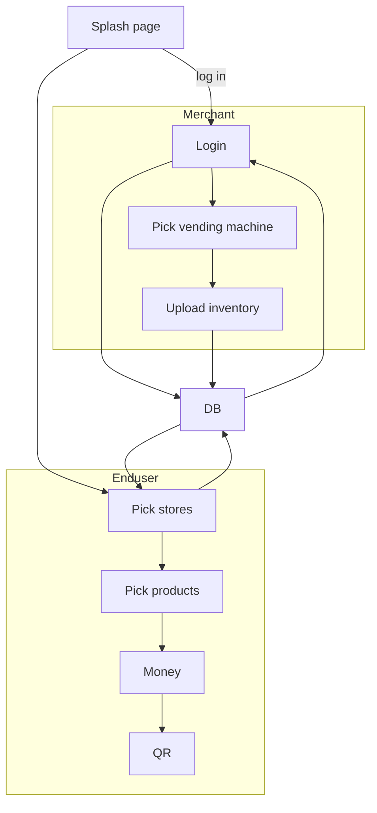

# Current TODO: 
1: Prerolls ADD AND DELETE  
2: FLOWERS DELETE  
3: VENDING DELETE  
4: VENDiNG ROW AND COLUMN  
5: Bounds checking on the forms ( some fields need to be numbers ) 

# dispense_version3
https://github.com/mulefish/dispense_version3

# DB 
Postgres? Currently focusing on SQLite, because it is a easier. Later TODO: Port to PostGres.

# DB Local machine commands: 
pmontgomery@FVFH51FAQ6LW bin % brew services stop postgresql
#(base) pmontgomery@FVFH51FAQ6LW bin % brew services start postgresql
#(base) pmontgomery@FVFH51FAQ6LW bin % psql -U pmontgomery -H
 
# DB TODO: 
1 - settle on a DB schema 
2 - Get more solid on Google Cloud DB 
3 - Port local DB to Google Cloud DB 

# Flow

